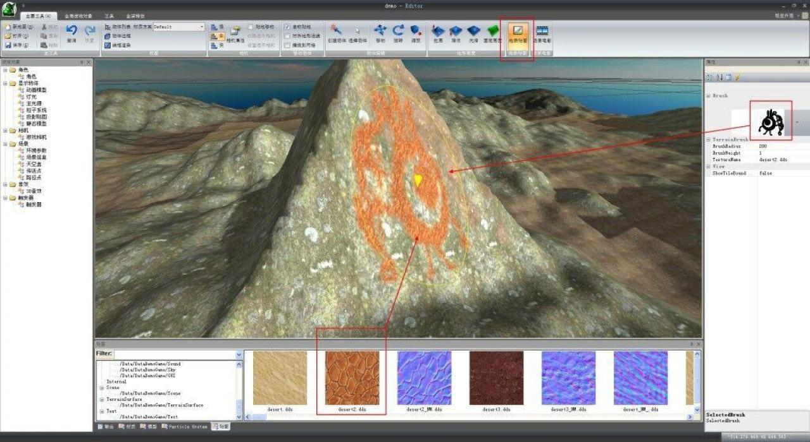
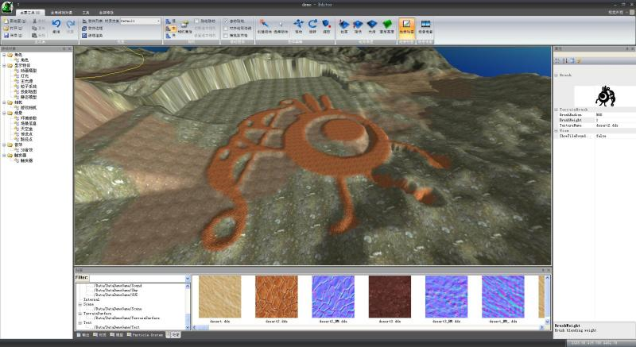
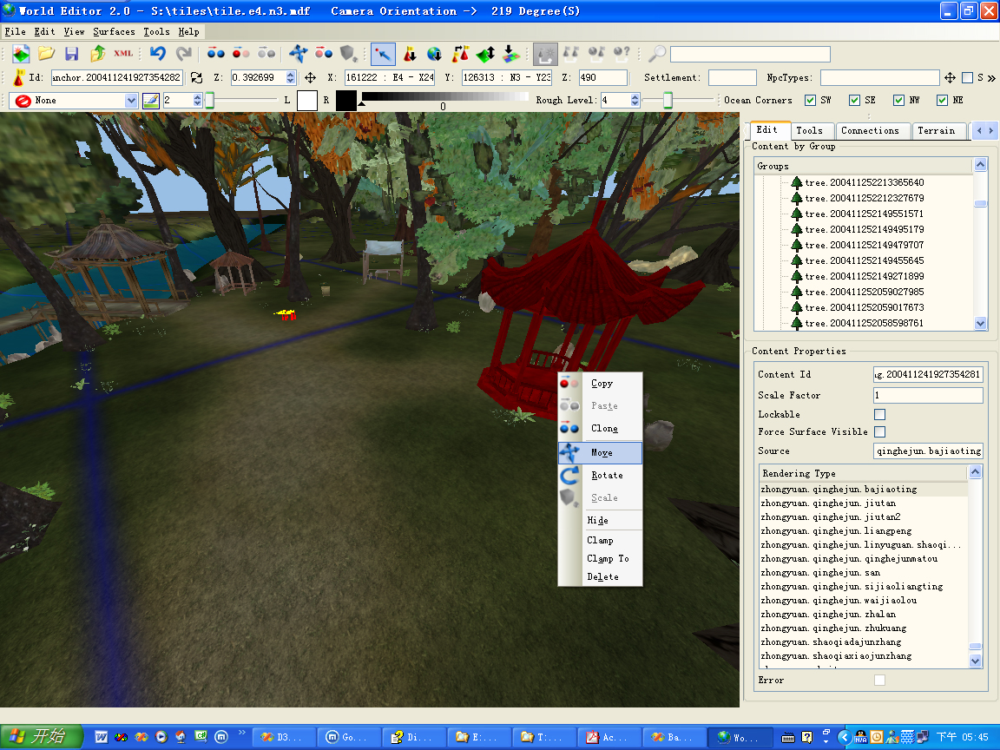

# OgreGameEngine
Ogen- OGRE Game Engine,Build with MFC(in 2009).

## 1.Install
### 1.1 VS2010
https://my.visualstudio.com/Downloads?q=visual%20studio%202010&pgroup=

#### Property inheritance in Visual Studio projects
https://learn.microsoft.com/en-us/cpp/build/project-property-inheritance?view=msvc-170

### 1.2 Ogre[v1-7-0]
  https://github.com/OGRECave/ogre.git

### 1.3 CEGUI[0.7.6]
http://cegui.org.uk/download/cegui-076
http://prdownloads.sourceforge.net/crayzedsgui/CEGUI-DEPS-0.7.x-r3-vc10.zip?download
https://github.com/cegui/cegui/tree/v0-7-6

### 1.4 boost[1_44_0]
https://www.boost.org/users/history/version_1_44_0.html
boost build command(with 32 threads build):
<code>bootstrap.bat
bjam --build-dir=".\boost" toolset=msvc-10.0 --build-type=complete --with-date_time --with-thread -j 32</code>

### 1.5 ogg
https://github.com/xiph/ogg.git

### 1.6 vorbis
https://gitlab.xiph.org/xiph/vorbis

## 2.Crash CMFCToolBarImages::SmoothResize
* change display dpi to 100%
* [OK]https://devblogs.microsoft.com/cppblog/mfc-applications-now-default-to-being-dpi-aware/
* https://developercommunity.visualstudio.com/t/mfc-application-crashes-when-using-a-ribbon-with-h/1306626
* https://social.msdn.microsoft.com/Forums/en-US/0b2c412e-439f-4614-b4da-149eac517064/unable-to-transfer-mfc-ribbon-app-to-another-pc?forum=vcmfcatl

Old memory, this editor is my first game project **[Wish (Mutable Realms)]** in 2004

